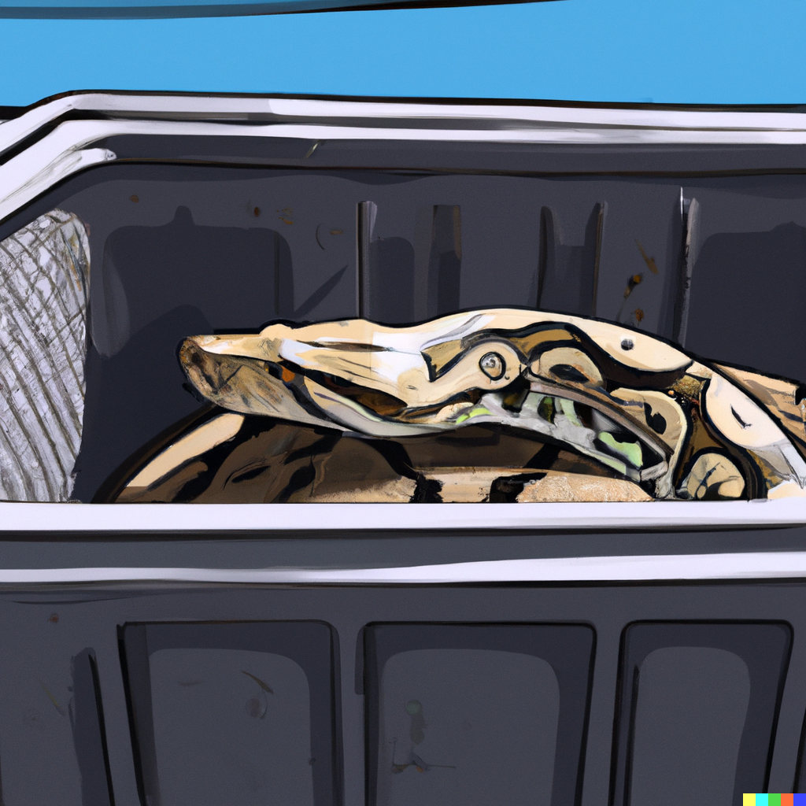

# Python Development Container Template


This repository serves as a template for Python projects, leveraging the power of Docker and Visual Studio Code's development containers. 

The main components of this template are:

- A `Dockerfile` that sets up a Python environment and installs necessary dependencies.
- A `devcontainer.json` file that configures how VS Code should use our Docker environment.

## Dockerfile

The Dockerfile is a script that Docker executes to build a Docker image. This file contains a series of instructions telling Docker what base image to use, what files to copy over, what commands to run, and more.

Here's a brief summary of what our Dockerfile does:

1. Starts from a Python base image (Version can be set in `devcontainer.json` under the `"Variant"` argument).
2. Sets a working directory.
3. Optionally installs additional OS packages.
4. Optionally sets up GPU support.
5. Copies the `requirements.txt` file into the container.
6. Installs the Python dependencies.
7. Copies your application into the container.

You can customize your Dockerfile according to your project requirements. To uncomment any section, just remove the "#" character at the beginning of the line.

### Adding new software to Dockerfile

Here are step by step instructions to add a new software to your Dockerfile:

1. Identify the command to install your software. This command will differ based on the software and the base image's operating system. For Debian based distributions, you'll typically use `apt-get install`.

2. Add a new `RUN` instruction to your Dockerfile with this command. It's a good practice to clean up after your installation to keep the Docker image size small. A typical install instruction may look like this:
   
```dockerfile
RUN apt-get update && apt-get install -y \
    your-software \
    && rm -rf /var/lib/apt/lists/*
```

3. Rebuild your Docker image. You can do this in VS Code by pressing `F1`, then typing "Rebuild Container".

## devcontainer.json

This file configures how VS Code should use our Docker container. Some of its main features are:

- Defines the Dockerfile for the build.
- Specifies a list of extensions to be installed automatically.
- Defines a list of ports to forward from the container to the host machine.
- Specifies a command to run after the container is created.
- Sets up a specific user to avoid permission issues.

Much like the Dockerfile, you can customize this file to better fit your project. To uncomment any line, simply remove the "//" characters at the beginning of the line.

Remember, the goal of using a dev container is to provide a consistent and reproducible development environment. Take the time to carefully define what goes into your Dockerfile and `devcontainer.json` files, and your team (or future you) will thank you!

## Handling Python Libraries and Dependencies

In this template, we manage Python libraries and dependencies through `requirements.txt` file and Python virtual environments.

### How to Install New Libraries

To install new libraries:

1. **Install in the Docker Container:** You can install libraries directly into the Docker container using pip. For example:

```bash
pip install numpy
```

2. **Add to `requirements.txt`:** If you want the library to be included every time the Docker container is built, add the library to your `requirements.txt` file:

```bash
numpy==1.21.0
```

3. **Rebuild the Docker Container:** In VS Code, you can rebuild the Docker container by pressing `F1`, then typing and selecting "Remote-Containers: Rebuild Container". This will reinstall all libraries listed in `requirements.txt`.

### Working with Subprojects

If you're working with subprojects that have different dependencies, it's ideal to use Python virtual environments for isolation. Here are the steps to create an isolated environment for a subproject:

1. **Create a Subproject Directory:** Within your main project, create a directory for each subproject.

```bash
/my_main_project
  /subproject1
  /subproject2
  ...
```

2. **Create a Virtual Environment:** Within each subproject directory, create a new Python virtual environment using the `venv` module:

```bash
python -m venv ./venv
```

This will create a new directory called `venv` within your subproject directory, which will contain a copy of the Python interpreter, the standard library, and various supporting files.

3. **Activate the Virtual Environment:** Before you start working on a subproject, activate the virtual environment:

```bash
source ./venv/bin/activate
```

4. **Install Subproject Dependencies:** Now you can install any Python libraries that are specific to the subproject. These libraries will be installed within the virtual environment and will not affect your main project or other subprojects. You can create a separate `requirements.txt` file for each subproject and install the libraries using pip:

```bash
pip install -r requirements.txt
```

5. **Deactivate the Virtual Environment:** When you're done working on a subproject, you can deactivate the virtual environment:

```bash
deactivate
```

Remember to reactivate the virtual environment each time you start a new terminal session and want to work on a subproject.

### What to Pay Attention to in This Docker Container

When using this Docker container for development, there are a few things to keep in mind:

1. **Persistence:** Anything you install or any data you create within the container will be lost once the container is removed. To keep data between runs, use Docker volumes to persist data in specified directories. In this template, the entire project directory is mounted as a volume, so your project files are persisted between runs.

2. **Permissions:** The Dockerfile is set up to run commands as root. This can cause permission issues with files created within the container, as they will also be owned by root. If this causes problems, you can uncomment the `remoteUser` line in `devcontainer.json` to run commands as a non-root user.

3. **Port Forwarding:** By default, the ports specified in `forwardPorts` in `devcontainer.json` will be forwarded from the container to the host. If you need other ports to be accessible, add them to this list.

4. **Environment Variables:** If your application needs certain environment variables to be set, you can use the `env` field in `devcontainer.json`.

By keeping these points in mind, you can avoid common issues and make the most of using this Docker container for development.

## Additional Comments

- After setup and building your development container, you can open a terminal in VS Code by pressing `Ctrl + Shift + ~`. This will open a terminal within the container, where you can run commands like `python`. You can also open a terminal on your host machine by pressing `Ctrl + Shift + C`.
- Your project directory (where the `.devcontainer` folder is located) is mounted as a volume in the container. This means that any changes you make to your project files will be reflected in the container, and vice versa. The folder `/workspace` should contain this project directory where you can find your project files.

## Useful Commands
### Docker
- `docker ps` - List all running containers
- `docker ps -a` - List all containers
- `docker images` - List all images
- `docker rm <container_id>` - Remove a container
- `docker rmi <image_id>` - Remove an image
- `docker exec -it <container_id> bash` - Open a bash terminal in a running container
- `docker build -t <image_name> .` - Build a Docker image from a Dockerfile

### Linux
- `ls` - List files in current directory
- `ls -a` - List all files in current directory
- `ls -l` - List files in current directory with details
- `ls -la` - List all files in current directory with details
- `cd ..` - Go up one directory
- `cd ~` - Go to home directory
- `cd -` - Go to previous directory
- `cd /` - Go to root directory
- `cd <directory>` - Change directory
- `pwd` - Print working directory
- `mkdir <directory>` - Create a new directory
- `rm <file>` - Remove a file
- `rm -r <directory>` - Remove a directory
- `cp <file> <new_file>` - Copy a file
- `cp -r <directory> <new_directory>` - Copy a directory
- `mv <file> <new_file>` - Move a file
- `mv <directory> <new_directory>` - Move a directory
- `cat <file>` - Print contents of a file
- `head <file>` - Print first 10 lines of a file
- `tail <file>` - Print last 10 lines of a file
- `less <file>` - View a file
- `du -sh <directory>` - Get size of a directory
- `free -h` - Get free memory
- `df -h` - Get free disk space
- `top` - View running processes
- `kill <process_id>` - Kill a process
- `killall <process_name>` - Kill all processes with a given name
- `ps` - List running processes
- `ps -a` - List all processes
- `ps -u <user>` - List processes for a given user
- `ps -aux` - List all processes with details
- `ps -aux | grep <process_name>` - List all processes with details and filter by name
- `chmod +x <file>` - Make a file executable
- `chmod -x <file>` - Make a file not executable
- `chmod 777 <file>` - Give all permissions to a file
- `chmod 000 <file>` - Remove all permissions from a file
- `chown <user> <file>` - Change the owner of a file
- `chown -R <user> <directory>` - Change the owner of a directory and all its contents
- `chgrp <group> <file>` - Change the group of a file
- `watch -n<seconds> <command>` - Run a command every n seconds
- `curl <url>` - Make a GET request to a URL
- `curl -X POST <url>` - Make a POST request to a URL
- `curl -X PUT <url>` - Make a PUT request to a URL
- `curl -X DELETE <url>` - Make a DELETE request to a URL

### Python
- `python version` - Get Python version
- `python <file>` - Run a Python file
- `python -h` - Get help for Python
- `python -c "print('Hello World!')"` - Run a Python command
- `python -m venv <directory>` - Create a Python virtual environment
- `source <directory>/bin/activate` - Activate a Python virtual environment
- `deactivate` - Deactivate a Python virtual environment
- `python -m pip install --upgrade pip` - Upgrade pip
- `pip install <package>` - Install a Python package
- `pip install -r <requirements_file>` - Install Python packages from a requirements file
- `pip freeze` - List installed Python packages
- `pip freeze > <requirements_file>` - Save installed Python packages to a requirements file
- `pip uninstall <package>` - Uninstall a Python package
- `pip uninstall -r <requirements_file>` - Uninstall Python packages from a requirements file
- `pip show <package>` - Show information about a Python package
- `pip search <package>` - Search for a Python package
- `pip list` - List installed Python packages
- `pip list --outdated` - List outdated Python packages
- `pip list --uptodate` - List up-to-date Python packages
- `pip list --format=json` - List installed Python packages in JSON format
- `pip list --format=yaml` - List installed Python packages in YAML format
- `pip list --format=csv` - List installed Python packages in CSV format
- `pip list --format=freeze > <requirements_file>` - Save installed Python packages to a requirements file